# Day 125: Introduction to Hashmaps and Map Implementation

Today we started learning about hashmaps and map implementations in C++.

## Key Concepts Covered

### Hashmaps / Maps

- A map is a collection of key-value pairs, where each key is unique
- Maps provide efficient lookup, insertion, and deletion operations based on keys
- Also known as associative arrays or dictionaries in other programming languages

### Hash Tables

- Data structure that implements an associative array abstract data type
- Uses a hash function to compute an index into an array of buckets
- Allows for fast data retrieval with O(1) average time complexity

### Types of Maps in C++

1. **Ordered Map** (`std::map`)

   - Stores elements in a sorted order (by key)
   - Implemented using a balanced binary search tree
   - O(log n) time complexity for operations

2. **Unordered Map** (`std::unordered_map`)
   - Stores elements in no particular order
   - Implemented using hash tables
   - O(1) average time complexity for operations

## Hash Table Internals

Hash tables work through several key components and processes:

```mermaid
%%{init: {'theme':'dark', 'themeVariables': { 'primaryColor': '#242424', 'primaryTextColor': '#ffffff', 'primaryBorderColor': '#aaaaaa', 'lineColor': '#ffffff', 'secondaryColor': '#444444', 'tertiaryColor': '#333333'}}}%%
flowchart TB
    subgraph Hash Table Internals
    A[Key] --> B[Hash Function]
    B --> C[Hash Code]
    C --> D[Compression Function]
    D --> E[Index in Bucket Array]
    E --> F{Collision?}
    F -->|Yes| G[Collision Resolution]
    G --> H[Open Hashing/Separate Chaining]
    G --> I[Closed Addressing/Open Addressing]
    I --> J[Linear Probing]
    I --> K[Quadratic Probing]
    I --> L[Double Hashing]
    F -->|No| M[Store Key-Value]
    end
    style Hash Table Internals fill:#222,stroke:#666,stroke-width:2px
```



### Key Components of Hash Tables

1. **Bucket Array**:

   - An array divided into smaller segments (buckets)
   - Each bucket corresponds to a specific hash value
   - Allows for efficient organization of data

2. **Hash Function**:

   - Converts input key into a fixed-size string of bytes
   - Creates a "digest" that should be unique for each input
   - Good hash functions minimize collisions and distribute keys uniformly

3. **Compression Function**:

   - Reduces large hash codes to fit within the bucket array size
   - Preserves essential information while making the index manageable
   - Often uses modulo operation: `index = hashCode % arraySize`

4. **Hash Code**:

   - Numerical value generated from the key
   - Used to determine the bucket where data will be stored
   - Should distribute values evenly across available buckets

5. **Collision Handling**:

   - **Open Hashing/Separate Chaining**:

     - Each bucket contains a linked list of entries
     - New colliding entries are added to the list
     - Simple but may use more memory due to pointers

   - **Closed Addressing/Open Addressing**:
     - All elements stored directly in the hash table array
     - Uses probing sequences to find next available bucket
     - Techniques include:
       - Linear Probing: `(hash(key) + i) % size`
       - Quadratic Probing: `(hash(key) + i² + i) % size`
       - Double Hashing: `(hash1(key) + i * hash2(key)) % size`

### Internal Working Steps

1. Generate a hash code from the key using a hash function
2. Compress the hash code to fit within the bucket array size
3. Check if the bucket at that index is empty
4. If empty, store the key-value pair
5. If not empty (collision), use a resolution strategy:
   - For separate chaining: add to the linked list at that bucket
   - For open addressing: find next available bucket using probing

## Problems Solved

### 1. Hashmap Implementation

- File: [hashmap.cpp](./hashmap.cpp)
- Basic implementation and operations of maps:
  - Creation
  - Insertion
  - Updation
  - Searching
  - Size querying
  - Presence checking
  - Erasure
  - Iteration techniques

### 2. LeetCode 3005: Count Elements With Maximum Frequency

- File: [Leetcode_3005.cpp](./Leetcode_3005.cpp)
- Problem: Find the total frequency of elements that have the maximum frequency
- Approach:
  - Use a hashmap to count the frequency of each element
  - Find the maximum frequency among all elements
  - Count the total occurrences of all elements with this maximum frequency
- Time Complexity: O(n), where n is the number of elements in the array
- Space Complexity: O(k), where k is the number of unique elements

### 3. Hash Table Internals

- File: [hashing_internals.cpp](./hashing_internals.cpp)
- Detailed explanation of how hash tables work internally
- Key components: bucket arrays, hash functions, compression functions
- Collision resolution strategies and their pros/cons

## Iteration Techniques for Hashmaps

1. Using key-value pairs:

```cpp
for (auto i : map) {
    cout << "key: " << i.first << " --> " << i.second << endl;
}
```

2. Using iterators:

```cpp
for (auto it = map.begin(); it != map.end(); it++) {
    cout << "key: " << it->first << " --> " << it->second << endl;
}
```

## Interview-Important Concepts

### 1. Time Complexity Analysis

| Operation | Average Case | Worst Case |
| --------- | ------------ | ---------- |
| Insertion | O(1)         | O(n)       |
| Deletion  | O(1)         | O(n)       |
| Search    | O(1)         | O(n)       |

Worst case occurs when many keys hash to the same bucket, creating a long chain or probe sequence.

### 2. Load Factor

- Ratio of number of entries to number of buckets: `load_factor = n/k`
- Crucial for hash table performance
- When load factor exceeds a threshold (typically 0.7), rehashing is performed
- Rehashing: creating a new larger table and transferring all entries

### 3. Common Interview Questions

1. **Collision Resolution**:

   - Be prepared to explain and compare separate chaining vs. open addressing
   - Know the trade-offs in terms of memory usage and performance

2. **Hash Function Design**:

   - Properties of good hash functions
   - How to minimize collisions for specific types of data

3. **Applications**:

   - Implementing LRU Cache
   - Detecting duplicates in an array
   - Two-Sum, Group Anagrams, Valid Sudoku problems

4. **Language-Specific Implementation**:

   - C++: `std::unordered_map` vs. `std::map`
   - Internal implementation differences
   - When to use which container based on requirements

5. **Edge Cases**:
   - Handling hash table resizing/rehashing
   - Performance degradation under high collision rates
   - Strategies for very large datasets

## Key Takeaways

- Hashmaps provide efficient key-value storage and retrieval
- Different map types have different performance characteristics
- Maps are essential for solving frequency-based problems efficiently
- Understanding iteration techniques for maps is crucial for effective use
- Hash function quality directly impacts hash table performance
- Collision resolution strategy selection depends on expected data distribution
- Load factor management is critical for maintaining performance
