# Day 126: Trie Data Structure

Today we explored the Trie data structure, also known as a prefix tree, which is specialized for efficient storage and retrieval of string keys.

## What is a Trie?

A Trie (pronounced "try") is a tree-like data structure that stores a dynamic set of strings, typically used for fast prefix searches. Each node in the trie represents a single character, and the path from the root to a node represents a string.

```mermaid
%%{init: {'theme':'dark', 'themeVariables': { 'primaryColor': '#242424', 'primaryTextColor': '#ffffff', 'primaryBorderColor': '#aaaaaa', 'lineColor': '#ffffff', 'secondaryColor': '#444444', 'tertiaryColor': '#333333'}}}%%
graph TD
    Root[Root] --> A[a]
    Root --> B[b]
    A --> C[p]
    C --> D[p]
    D --> E[l]
    E --> F[e*]
    C --> G[t*]
    B --> H[a]
    H --> I[t*]
    style Root fill:#222,stroke:#666,stroke-width:2px
```



_Note: Nodes marked with _ indicate the end of a word\*

## Key Characteristics of Tries

1. **Efficient Prefix Operations**: Tries excel at operations involving prefixes, such as finding all words with a common prefix.
2. **Time Complexity**: Most operations (insert, search, delete) have O(m) time complexity, where m is the length of the key.
3. **Space Efficiency**: While tries can consume more space than other data structures, they provide extremely fast retrieval and prefix-based operations.
4. **Node Structure**: Each node typically contains:
   - An array of pointers to child nodes (one for each possible character)
   - A flag indicating whether the node represents the end of a word

## Common Applications

- **Autocomplete/Predictive Text**: Suggest words as users type
- **Spell Checkers**: Find valid words or suggest corrections
- **IP Routing (CIDR)**: Fast lookup of network addresses
- **Longest Prefix Matching**: Find the longest matching prefix in a set of strings
- **Dictionary Implementation**: Efficient storage and retrieval of words

## Problems Solved

### 1. Basic Trie Implementation

- File: [Trie.cpp](./Trie.cpp)
- Implementation details:
  - Node structure with character, children array, and terminal flag
  - Methods for insertion, search, and deletion
  - Time Complexity: O(m) for all operations where m is string length
  - Space Complexity: O(ALPHABET_SIZE _ m _ n) where n is number of words

### 2. LeetCode 208: Implement Trie (Prefix Tree)

- File: [Leetcode_208.cpp](./Leetcode_208.cpp)
- Problem: Implement a trie with insert, search, and startsWith functions
- Approach:
  - Create a TrieNode structure with character, children array, and terminal flag
  - Implement insertion by traversing/creating nodes for each character
  - Implement search by traversing nodes and checking if the last node is marked as terminal
  - Implement startsWith by traversing nodes without checking terminal flag
- Time Complexity: O(m) for all operations where m is string length
- Space Complexity: O(26 _ m _ n) where n is number of words

## Trie vs. Hash Table

| Aspect             | Trie                   | Hash Table                          |
| ------------------ | ---------------------- | ----------------------------------- |
| Prefix Search      | O(m) - Excellent       | Not supported directly              |
| Exact Search       | O(m)                   | O(1) average                        |
| Space              | Higher (many pointers) | Lower for small datasets            |
| Insertion          | O(m)                   | O(1) average                        |
| Deletion           | O(m)                   | O(1) average                        |
| Autocomplete       | Naturally supported    | Requires additional data structures |
| Word Relationships | Preserves              | Does not preserve                   |

## Implementation Details

### TrieNode Structure

```cpp
struct TrieNode {
  char c;                    // Character stored at this node
  TrieNode* children[26];    // Pointers to child nodes (for lowercase English letters)
  bool isTerminalNode;       // Flag to mark end of words
};
```

### Key Operations

1. **Insertion**:

   - Start from root
   - For each character in the word:
     - If a node doesn't exist for the character, create one
     - Move to that node
   - Mark the last node as a terminal node

2. **Search**:

   - Start from root
   - For each character in the word:
     - If a node doesn't exist for the character, return false
     - Move to that node
   - Return true if the last node is marked as terminal

3. **Prefix Search**:

   - Similar to search, but don't check if the last node is terminal

4. **Deletion**:
   - Search for the word
   - Mark the last node as non-terminal
   - Remove nodes that are not part of any other word (backtracking)

## Interview Tips

1. **Time/Space Analysis**: Be prepared to analyze the time and space complexity of trie operations.
2. **When to Use Tries**: Explain scenarios where tries outperform other data structures (autocomplete, prefix operations).
3. **Optimization**: Discuss ways to optimize tries (compression, alternative node structures).
4. **Implementation Choices**: Justify your choice of array vs. map/unordered_map for child nodes.
5. **Edge Cases**: Consider empty strings, non-existent words, and case sensitivity.

## Key Takeaways

- Tries are optimized for string operations, particularly those involving prefixes
- The time complexity of trie operations depends on the length of the word, not the number of words stored
- While they can be more memory-intensive than other structures, tries offer exceptional performance for specific use cases
- Understanding trie fundamentals helps with solving many string-related problems efficiently
