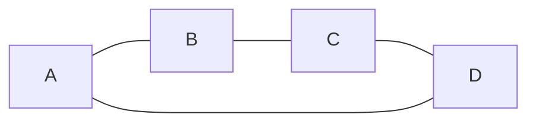
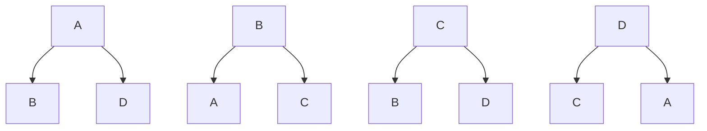
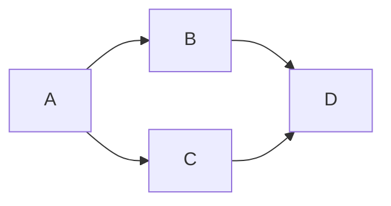
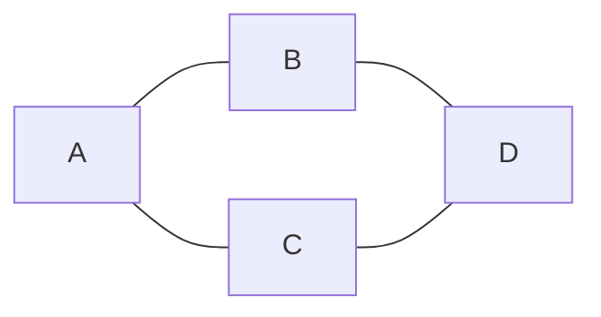
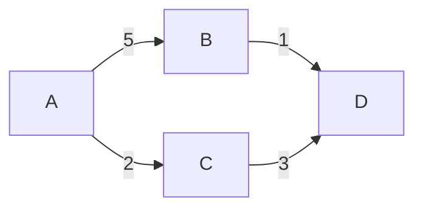
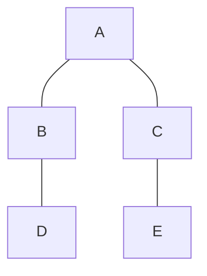
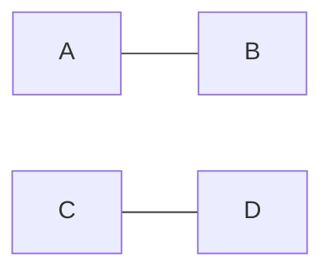
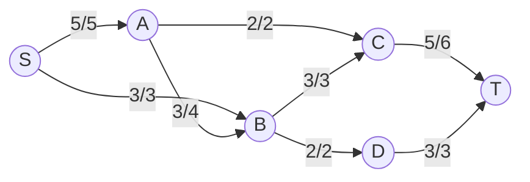
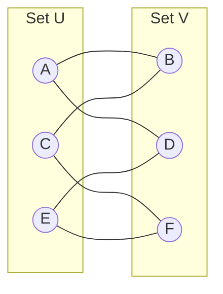
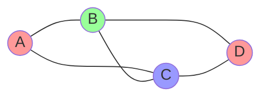

# Day 131: Graphs - Introduction and Basic Implementation

## Concepts Covered

- Graph data structure introduction
- Types of graphs (directed, undirected, weighted, unweighted, etc.)
- Graph terminology (nodes, edges, degree, path)
- Graph representations (adjacency list, adjacency matrix)
- Basic graph implementation using adjacency list

## Problems Solved

1. **Basic Graph Implementation**: Implemented a graph data structure using an adjacency list representation with templated nodes.
2. **Print Adjacency List**: Solved the problem of creating and returning an adjacency list for an undirected graph.

## Approach and Implementation

### Graph Implementation

1. **Data Structure Used**:

   - Used `unordered_map<T, list<T>>` to represent an adjacency list
   - Each node maps to a list of its adjacent nodes

2. **Core Functions**:

   - `addEdge(u, v, directed)`: Adds an edge between vertices u and v. If directed is false (default), adds edges in both directions.
   - `printGraph()`: Prints the adjacency list representation of the graph.

3. **Time Complexity**:

   - `addEdge`: O(1)
   - `printGraph`: O(V + E) where V is the number of vertices and E is the number of edges

4. **Space Complexity**:
   - O(V + E) for storing the adjacency list

### Print Adjacency List Problem

1. **Approach**:

   - Create a graph using the provided edges
   - For each vertex, retrieve its adjacency list
   - Return the adjacency lists for all vertices

2. **Time Complexity**:

   - O(V + E) where V is the number of vertices and E is the number of edges

3. **Space Complexity**:
   - O(V + E) for storing the adjacency lists

## Graph Representations with Visualizations

Graphs can be represented in different ways in computer memory, each with its own advantages and disadvantages. The two most common representations are:

### 1. Adjacency Matrix

An adjacency matrix is a 2D array of size V×V (where V is the number of vertices) that represents connections between nodes. For unweighted graphs, we use 1 to indicate an edge and 0 to indicate no edge. For weighted graphs, we use the weight value instead of 1.

For a simple undirected graph:



The adjacency matrix would be:

```
    A  B  C  D
A | 0  1  0  1 |
B | 1  0  1  0 |
C | 0  1  0  1 |
D | 1  0  1  0 |
```

**Advantages:**

- Simple to implement and understand
- Edge lookup is O(1)
- Works well for dense graphs
- Easy to implement algorithms like Floyd-Warshall

**Disadvantages:**

- Space complexity is O(V²), inefficient for sparse graphs
- Adding/removing vertices requires resizing the matrix
- Iterating over all edges from a vertex takes O(V) time

### 2. Adjacency List

An adjacency list stores a list of adjacent vertices for each vertex in the graph. This can be implemented using arrays, linked lists, or hash maps.

For the same undirected graph:


The adjacency list would be:

```
A → [B, D]
B → [A, C]
C → [B, D]
D → [C, A]
```

Visually represented:



**Advantages:**

- Space complexity is O(V+E), efficient for sparse graphs
- Adding a vertex is easier
- Iterating over all edges from a vertex is efficient
- Better for most graph algorithms like BFS and DFS

**Disadvantages:**

- Edge lookup takes O(degree) time
- Less intuitive for some operations
- Not as efficient for dense graphs

### 3. Edge List

Another representation is the edge list, which is simply a list of all edges in the graph.

```
Edges: [(A,B), (B,C), (C,D), (D,A)]
```

**Advantages:**

- Simple and memory-efficient
- Good for algorithms that process all edges sequentially

**Disadvantages:**

- Inefficient for finding neighbors of a vertex
- Edge lookup is O(E)

## Types of Graphs with Visualizations

### 1. Directed Graph (Digraph)

Edges have a direction, going from one vertex to another. Each edge is represented by an arrow indicating the direction of the relationship.



**Properties:**

- Relationships are one-way (like following someone on Twitter)
- In-degree: Number of incoming edges to a node
- Out-degree: Number of outgoing edges from a node
- Applications: Social media following, web links, traffic flow

### 2. Undirected Graph

Edges have no direction, and the connection between vertices is bidirectional. The relationship between nodes is symmetric.



**Properties:**

- Relationships are two-way (like friendship on Facebook)
- Degree of a node is simply the count of its connections
- Applications: Friend networks, electrical circuits, road networks

### 3. Weighted Graph

Edges have weights (costs) associated with them, representing the strength, distance, or cost of the connection.



**Properties:**

- Edge weights can represent distance, cost, capacity, etc.
- Algorithms like Dijkstra's use weights to find optimal paths
- Applications: Maps (with distances), network flow, cost optimization

### 4. Unweighted Graph

All edges have the same weight or no weight at all. The focus is on the presence of connections, not their strength.


**Properties:**

- All connections have equal importance
- Simplifies certain algorithms like BFS for shortest paths
- Applications: Basic connectivity problems, simple relationships

### 5. Cyclic Graph

Contains at least one cycle (a path that starts and ends at the same vertex).


**Properties:**

- Contains at least one circular path
- Can lead to infinite loops if not handled carefully in algorithms
- Applications: Circuit analysis, scheduling with dependencies

### 6. Acyclic Graph

Does not contain any cycles. You cannot follow a path that leads back to the starting node.



**Properties:**

- No circular paths
- Trees are a special case of acyclic graphs
- Directed Acyclic Graphs (DAGs) are particularly important in computing
- Applications: Dependency resolution, scheduling, hierarchical structures

### 7. Connected Graph

There is a path between every pair of vertices. All nodes can be reached from any starting node.


**Properties:**

- No isolated vertices or subgraphs
- Any node can reach any other node
- Applications: Network reliability, accessibility analysis

### 8. Disconnected Graph

At least one pair of vertices is not connected by a path. The graph contains separate components.



**Properties:**

- Contains two or more separate components
- Cannot traverse from one component to another
- Applications: Clustering, community detection, separate systems

## Common Graph Problems and Applications

### 1. Network Flow

Network flow problems involve finding the maximum flow through a network from a source to a sink.



**Algorithms:**

- Ford-Fulkerson Algorithm
- Edmonds-Karp Algorithm
- Dinic's Algorithm

**Applications:**

- Transportation networks
- Bipartite matching
- Project scheduling
- Image segmentation

### 2. Bipartite Graphs

A bipartite graph is one whose vertices can be divided into two disjoint sets U and V such that every edge connects a vertex in U to one in V.



**Applications:**

- Assignment problems
- Matching applications
- Conflict scheduling
- Social network analysis

### 3. Graph Coloring

Assigning colors to graph vertices such that no adjacent vertices have the same color.



**Applications:**

- Scheduling problems
- Register allocation in compilers
- Frequency assignment in radio networks
- Map coloring

## Practice Problems

### Basic Graph Traversal

1. [BFS of Graph](https://practice.geeksforgeeks.org/problems/bfs-traversal-of-graph/1)
2. [DFS of Graph](https://practice.geeksforgeeks.org/problems/depth-first-traversal-for-a-graph/1)
3. [Number of Islands](https://leetcode.com/problems/number-of-islands/)
4. [Flood Fill](https://leetcode.com/problems/flood-fill/)
5. [Rotting Oranges](https://leetcode.com/problems/rotting-oranges/)

### Path Finding

6. [Course Schedule](https://leetcode.com/problems/course-schedule/)
7. [Course Schedule II](https://leetcode.com/problems/course-schedule-ii/)
8. [Clone Graph](https://leetcode.com/problems/clone-graph/)
9. [Shortest Path in Binary Matrix](https://leetcode.com/problems/shortest-path-in-binary-matrix/)
10. [Network Delay Time](https://leetcode.com/problems/network-delay-time/)

### Cycle Detection

11. [Detect Cycle in an Undirected Graph](https://practice.geeksforgeeks.org/problems/detect-cycle-in-an-undirected-graph/1)
12. [Detect Cycle in a Directed Graph](https://practice.geeksforgeeks.org/problems/detect-cycle-in-a-directed-graph/1)
13. [Redundant Connection](https://leetcode.com/problems/redundant-connection/)
14. [Find Eventual Safe States](https://leetcode.com/problems/find-eventual-safe-states/)

### Connected Components

15. [Number of Connected Components in an Undirected Graph](https://leetcode.com/problems/number-of-connected-components-in-an-undirected-graph/)
16. [Is Graph Bipartite?](https://leetcode.com/problems/is-graph-bipartite/)
17. [Possible Bipartition](https://leetcode.com/problems/possible-bipartition/)

### Advanced Algorithms

18. [Cheapest Flights Within K Stops](https://leetcode.com/problems/cheapest-flights-within-k-stops/)
19. [Minimum Spanning Tree](https://practice.geeksforgeeks.org/problems/minimum-spanning-tree/1)
20. [Word Ladder](https://leetcode.com/problems/word-ladder/)

## Conclusion

Graphs are one of the most versatile and powerful data structures in computer science. They can model a wide variety of real-world scenarios and relationships. Understanding graphs and their algorithms is essential for solving complex problems efficiently.

Key takeaways from this day:

- Graphs can represent many types of relationships and networks
- Different graph representations have different trade-offs
- Basic operations like adding edges and traversing the graph are fundamental
- More advanced algorithms build on these basics to solve complex problems

As we continue our DSA journey, we'll explore more advanced graph algorithms like shortest paths, minimum spanning trees, and network flow problems. These algorithms have wide-ranging applications in fields from computer networking to artificial intelligence.
